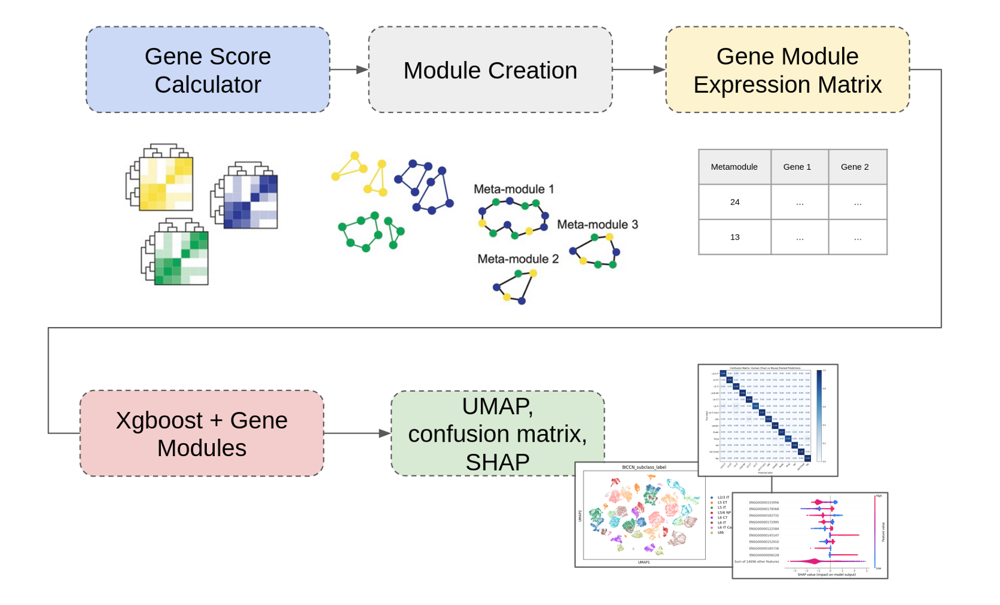

## Machine Learning tool for interpretable Single-Cell and Cross-Species analysis via Gene Modules 

---
## Abstract

Development of a machine learning tool that enhances single-cell RNA 
sequencing (scRNA-seq) classification using gene co-expression modules. 
Our approach integrates biologically meaningful meta-modules into an 
XGBoost classifier, improving both interpretability and cross-species 
generalization. Comparative benchmarks show that while gene-level models 
excel within species, module-based models achieve superior accuracy 
across species, supporting evolutionary conservation of gene modules. 

---

### 1. Code 

Contains all the scripts related to the single cell and gene module creation. 

*Computational workflow integrating gene co-expression modules with XGBoost classification.*

### 2. Results 

Contains scripts and files related to the results: 

- `results/`: Full thesis of the project and supplementary data 
- `csv_results/`: csv files with results 

### 3. Docker setup

Contains the files for the docker setup; dependencies, needed downloads, libraries, etc...

## Extra Information 

**Título:**  
 
Machine Learning tool for interpretable Single-Cell and 
Cross-Species analysis via Gene Modules 

**Autores:**  
Maria Cobo  

**Bachelor's degree:**  
Bachelor’s degree in Bioinformatics, minor in Health Sciences, Life Sciences, and Computer Sciences. 

**Tutors**  
Mohammed A. Mostajo Radji and Jesus Gonzalez Ferrer  

**Institución:**  
UCSC Genome Browser & ESCI-UPF

**Año:**  
2025
